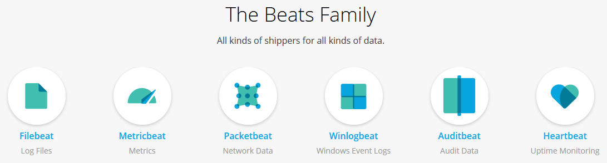

# elk-beats


ELK + Beats = (Elasticsearch + Logstash + Kibana) + (Filebeat + Metricbeat + Packetbeat + Auditbeat + Heartbeat)

## Resources available
- [elk-sample](https://github.com/aleroxac/elk-sample) files
- filebeat
- metricbeat
- packetbeat
- auditbeat
- heartbeat

## Setup
``` shell
## Installing Docker
curl -fsSL https://get.docker.com | bash

### Installing docker-compose
sudo curl -L "https://github.com/docker/compose/releases/download/1.27.4/docker-compose-$(uname -s)-$(uname -m)" -o /usr/local/bin/docker-compose
sudo chmod +x /usr/local/bin/docker-compose

## Running the docker-compose
docker-compose up -d
```